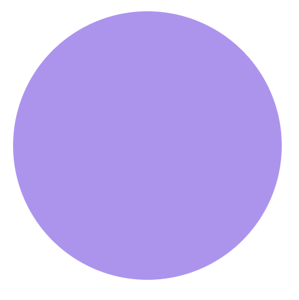
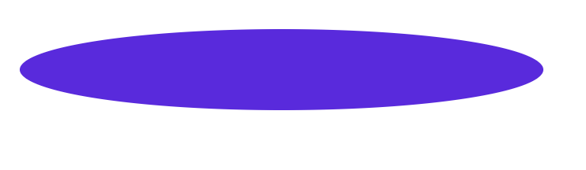

# Componente Ellipse

Este componente `Ellipse` representa una elipse o círculo con estilos personalizables.

## Props

- `background`: string  
  - Color de fondo de la elipse.
  
- `width`: string  
  - Ancho de la elipse.
  
- `height`: string  
  - Altura de la elipse.
  
- `opacity`: string  
  -Opacidad de la elipse (opcional).

  
  


## Uso

```jsx

// círculo
import Ellipse from './components/atoms/Ellipse';
const ExampleComponent = () => {
  return (
    <ThemeProvider theme={theme}>
      <Ellipse background={theme.palette.primary.main} width={'28.25rem'} height={'28.25rem'} opacity={'50%'}/> 
    </ThemeProvider>
  )
}

// elispe
import Ellipse from './components/atoms/Ellipse';

const ExampleComponent = () => {
  return (
    <ThemeProvider theme={theme}>
         <Ellipse background={theme.palette.primary.main} width={'41.4375rem'} height={'6.4375rem'}/>
    </ThemeProvider>
  )
}
