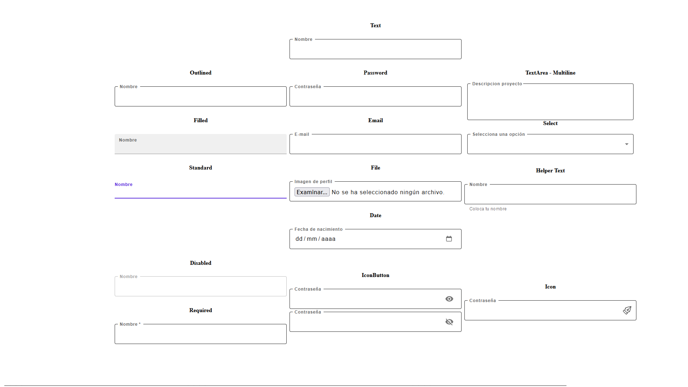

# Documentación de InputField

## Descripción
Este componente `InputField` es un componente de entrada personalizado que utiliza Material-UI (`@mui/material`). Proporciona flexibilidad en la entrada de texto, así como opciones para campos de selección.

## Propiedades

- **inputId**: `string`
  - ID único para el campo de entrada.

- **type**: `string`
  - Tipo de entrada (`text`, `number`, `password`, etc.).

- **variant**: `string`
  - Variante del campo de entrada (`outlined`, `filled`, etc.).

- **fullWidth**: `bool`
  - Indica si el campo de entrada debe ocupar todo el ancho disponible.

- **textLabel**: `string`
  - Etiqueta del campo de entrada.

- **value**: `string`
  - Valor del campo de entrada.

- **onChange**: `func`
  - Función de devolución de llamada para gestionar el cambio de valor.

- **helperText**: `string`
  - Texto de ayuda opcional.

- **multiline**: `bool`
  - Indica si el campo de entrada debe ser de varias líneas.

- **rows**: `number`
  - Número de filas para campos de entrada de varias líneas.

- **select**: `bool`
  - Indica si el campo de entrada es un campo de selección.

- **options**: `array`
  - Opciones para campos de selección.

- **required**: `bool`
  - Indica si el campo de entrada es obligatorio.

- **disabled**: `bool`
  - Indica si el campo de entrada está desactivado.

- **childrenAdornment**: `node`
  - Elemento de adorno para mostrar dentro del campo de entrada.



## Uso

```jsx
import InputField from './InputField';

<InputField
  inputId="example"
  type="text"
  variant="outlined"
  fullWidth={true}
  textLabel="Ejemplo"
  value={value}
  onChange={handleChange}
  helperText="Texto de ayuda opcional"
  multiline={false}
  rows={4}
  select={false}
  options={[{ value: 'opcion1', label: 'Opción 1' }, { value: 'opcion2', label: 'Opción 2' }]}
  required={true}
  disabled={false}
  childrenAdornment={<span>Adorno</span>}
/>
