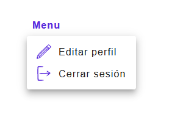
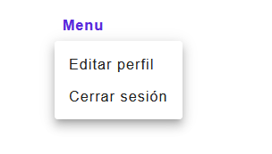

 BasicMenu

El componente `BasicMenu` es un menú básico de Material-UI que muestra una lista de elementos. Se utiliza principalmente para mostrar opciones de menú desplegable.

## Props

| Propiedad   | Tipo                              | Descripción                                              |
|-------------|-----------------------------------|----------------------------------------------------------|
| `list`      | `Array<Object>`                   | Lista de elementos del menú.                             |
| `anchorEl`  | `Element`                         | Elemento DOM que sirve como punto de anclaje del menú.   |
| `onClose`   | `Function`                        | Función que se llama cuando se cierra el menú.           |
| `idElement` | `String`                          | ID del elemento que se utiliza para describir el menú.   |

## Uso

```jsx
import PropTypes from 'prop-types';
import Menu from '@mui/material/Menu';
import MenuItem from '@mui/material/MenuItem';
import ListItemText from '@mui/material/ListItemText';
import ListItemIcon from '@mui/material/ListItemIcon';
import Divider from '@mui/material/Divider';

const BasicMenu = ({ list, anchorEl, onClose, idElement,idMenu }) => {
  const open = Boolean(anchorEl);

  return (
    <div>
      <Menu
        id={idMenu}
        anchorEl={anchorEl}
        open={open}
        onClose={onClose}
        MenuListProps={{
          'aria-labelledby': `${idElement}`,
        }}
      >
        {list.map((item) => (
          <MenuItem key={item.id} onClick={onClose}>
            {item.icon && <ListItemIcon>{item.icon}</ListItemIcon>}
            <ListItemText>{item.string}</ListItemText>
            <Divider/>
          </MenuItem>
        ))}
      </Menu>
    </div>
  );
};

BasicMenu.propTypes = {
  list: PropTypes.arrayOf(PropTypes.object).isRequired,
  anchorEl: PropTypes.instanceOf(Element), // Tipo específico de elemento DOM
  onClose: PropTypes.func,
  idElement: PropTypes.string,
};
export default BasicMenu;

```

## Ejemplo de uso

```jsx
import React, { useState } from 'react';
import BasicMenu from './BasicMenu';
import Button from './Button';
import theme from './theme/theme.js';

const App = () => {
  const [anchorEl, setAnchorEl] = useState(null);

  const handleClick = (event) => {
    setAnchorEl(event.currentTarget);
  };

  const handleClose = () => {
    setAnchorEl(null);
  };

   const menuItems = [
    {
        id: 'editProfile',
        string: "Editar perfil",
        path: "/editProfile", 
        icon: <Edit color={theme.palette.primary.main} width={24} />
      },
    { 
        id: 'logout',
        string: "Cerrar sesión",
        path: "/",
        icon: <Logout color={theme.palette.primary.main} width={24} />
      }
  ];

  return (
    <div>
      <button id="botonAccount" onClick={handleClick}>Menu</button>
      <Menu list={list} anchorEl={anchorEl} onClose={handleClose} idElement={"botonAccount"} idMenu={"menuAccount"}/>
    </div>
  );
};

export default App;
```



```jsx
import React, { useState } from 'react';
import BasicMenu from './BasicMenu';
import Button from './Button';

const App = () => {
  const [anchorEl, setAnchorEl] = useState(null);

  const handleClick = (event) => {
    setAnchorEl(event.currentTarget);
  };

  const handleClose = () => {
    setAnchorEl(null);
  };

   const menuItems = [
    {
        id: 'editProfile',
        string: "Editar perfil",
        path: "/editProfile", 
      },
    { 
        id: 'logout',
        string: "Cerrar sesión",
        path: "/",
      }
  ];

  return (
    <div>
      <button id="botonAccount" onClick={handleClick}>Menu</button>
      <Menu list={list} anchorEl={anchorEl} onClose={handleClose} idElement={"botonAccount"} idMenu={"menuAccount"}/>
    </div>
  );
};

export default App;
```


