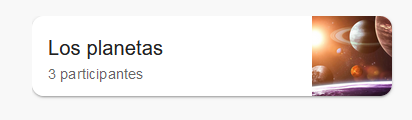

# Componente CardContainer

Este componente representa una tarjeta para mostrar información de un proyecto.

## Props

- **project** (`object`, required): Objeto que contiene la información del proyecto.
  - **name** (`string`, required): Nombre del proyecto.
  - **usersId** (`array`, required): Lista de identificadores de usuarios que participan en el proyecto.
  - **image** (`string`): URL de la imagen del proyecto.

## Uso

```jsx
import PropTypes from 'prop-types';
import Card from '@mui/material/Card';
import CardContent from '@mui/material/CardContent';
import CardMedia from '@mui/material/CardMedia';
import Typography from '@mui/material/Typography';
import { CardActionArea } from '@mui/material';

/**
 * Componente para mostrar la información de un proyecto en una tarjeta.
 * @param {Object} props - Propiedades del componente.
 * @param {Object} props.project - Información del proyecto.
 * @param {string} props.project.name - Nombre del proyecto.
 * @param {number[]} props.project.usersId - Lista de identificadores de usuarios participantes.
 * @param {string} [props.project.image] - URL de la imagen del proyecto.
 */
const CardContainer = ({ project }) => {
  return (
    <Card sx={{ maxWidth: 360, maxHeight: 80, borderRadius: '12px' }}>
      <CardActionArea sx={{ display: 'flex' }}>
        <CardContent sx={{ padding: '1rem', width: '248px', height: '48px', textAlign: 'left' }}>
          <Typography variant="h6" component="div">
            {project.name}
          </Typography>
          <Typography variant="body2" color="text.secondary">
            {`${project.usersId.length} participantes`}
          </Typography>
        </CardContent>
        {project.image ? (
          <CardMedia
            component="img"
            sx={{ width: '80px', height: '80px', objectFit: 'cover' }}
            image={project.image}
            alt={project.name}
          />
        ) : null}
      </CardActionArea>
    </Card>
  );
};

CardContainer.propTypes = {
  project: PropTypes.shape({
    name: PropTypes.string.isRequired,
    usersId: PropTypes.arrayOf(PropTypes.number).isRequired,
    image: PropTypes.string,
  }).isRequired,
};

export default CardContainer;
```



## Ejemplo de uso: 

```jsx

import PropTypes from 'prop-types';
import {Box} from '@mui/material';
import CardContainer from '../CardContainer';

const Dashboard = ({projects}) => {

  return (
    <Box sx={{width: '936px', height: '696px', display: 'flex', gap: '1.5rem', flexWrap: 'wrap', justifyContent: 'space-between',  overflow: 'hidden'}}>
        {
            projects.map(project => {
                return <CardContainer key={project.projectId} project={project}/>
            })
        }
    </Box>
  )
}

Dashboard.propTypes = {
  projects: PropTypes.arrayOf(PropTypes.object).isRequired
}

export default Dashboard
```