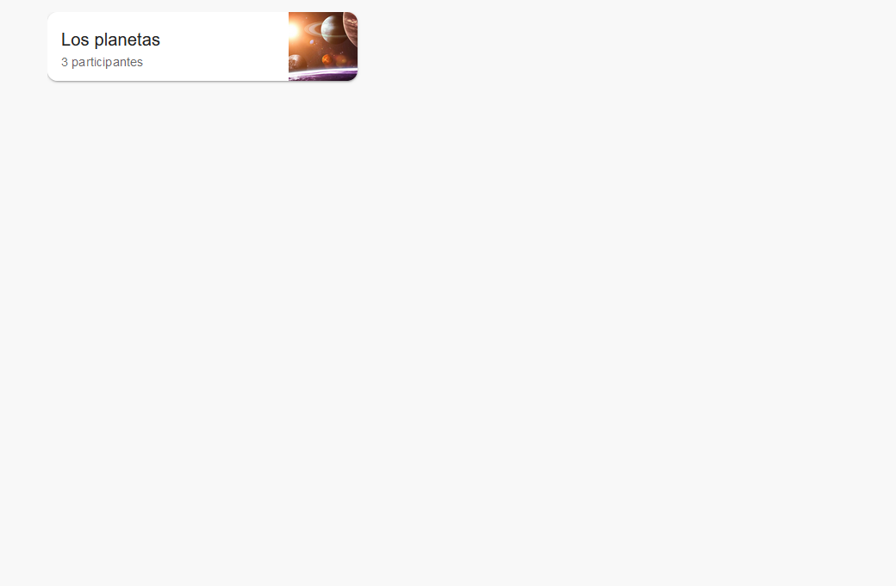
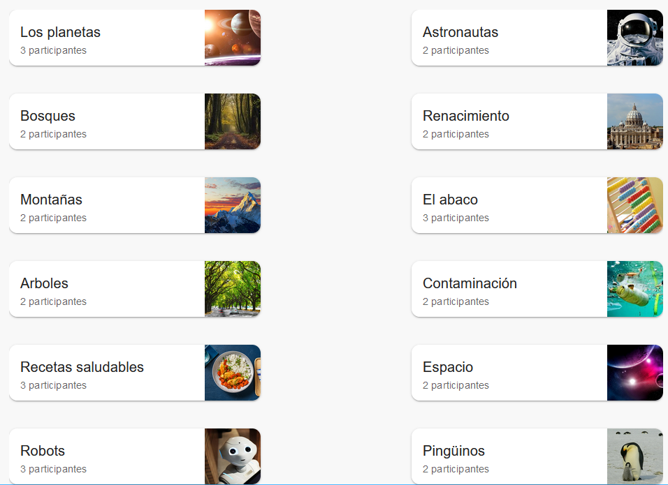

# Dashboard

Componente para mostrar un tablero con proyectos.
Este componente toma un array de objetos projects y renderiza un CardContainer para cada uno de ellos en un tablero.

## Props

- `projects` (array, requerido): Array de objetos que representan los proyectos a mostrar en el tablero.

## Uso

```jsx
import PropTypes from 'prop-types';
import { Box } from '@mui/material';
import CardContainer from '../CardContainer';

const Dashboard = ({ projects }) => {

  return (
    <Box sx={{width: '936px', height: '696px', display: 'flex', gap: '1.5rem', flexWrap: 'wrap', justifyContent: 'space-between'}}>
        {
            projects.map(project => {
                return <CardContainer key={project.projectId} project={project}/>
            })
        }
    </Box>
  )
}

Dashboard.propTypes = {
  projects: PropTypes.arrayOf(PropTypes.object).isRequired
}

export default Dashboard;
```

## Ejemplo de uso
```jsx
import { useState, useEffect } from 'react';
import Dashboard from './Dashboard';
import data from '../../data/oneProject.json'; // simulación de base de datos

const MyComponent = () => {
    const [projects, setProjects] = useState([]);

    useEffect(() => {
        setProjects(data.projects);
    }, [])


  return (
    <>
        <Dashboard projects={projects} /> 
    </>
  )
}

export default MyComponent;
```


