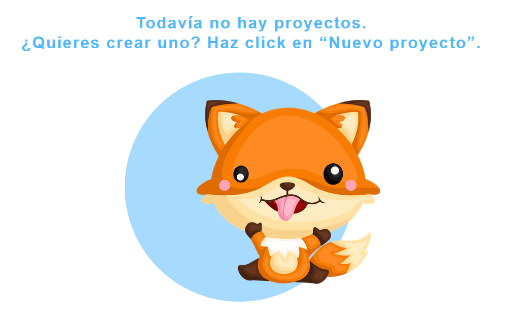

# Componente Empty

El componente `Empty` es utilizado para representar un estado vacío en la interfaz de usuario, mostrando un título, un subtítulo y una imagen.

## Propiedades

- `title` (string): El título a mostrar en el componente.
- `subtitle` (string): El subtítulo a mostrar en el componente.
- `color` (string): El color a aplicar al texto y al fondo del componente.

## Uso

```jsx
import React from 'react';
import PropTypes from 'prop-types';
import { Typography } from '@mui/material';
import Ellipse from '../../atoms/Ellipse';
import imgEva from '../../../assets/images/eva/eva_pet.png';
import './Empty.css';

const Empty = ({title, subtitle, color}) => {
  return (
    <div className='empty_container'>
        {title && <Typography variant='h1' color={color}>{title}</Typography>}
        {subtitle && <Typography variant='h1' color={color}>{subtitle}</Typography>}
        <div className='img_container'>            
            <Ellipse background={color} width={'28.25rem'} height={'28.25rem'} opacity={'50%'}/> 
            
        </div>
    </div>
  )
}

Empty.propTypes = {
    title: PropTypes.string,
    subtitle: PropTypes.string,
    color: PropTypes.string.isRequired,
};

export default Empty;
```

## Ejemplo de Uso:
```jsx

import { ThemeProvider } from '@mui/material/styles';
import theme from './theme/theme.js';
import Empty from './components/molecules/Empty';
import './App.css';

function MyComponent() {

  return (
    <ThemeProvider theme={theme}>
      <Empty color={theme.palette.accent.main} title={'Todavía no hay proyectos.'} subtitle={'¿Quieres crear uno? Haz click en “Nuevo proyecto”.'}/>
    </ThemeProvider>
  )
}

export default MyComponent
```

