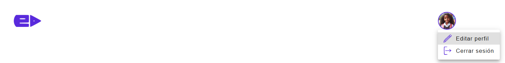

# Header Component

El componente `Header` representa la barra de encabezado de la aplicación.

## Propiedades
    None

## Funciones

    None

## Componentes Utilizados

    AvatarContainer: Este componente muestra un avatar.
    Logo: Este componente muestra un logotipo.
    Menu: Este componente muestra un menú desplegable.
    Edit: Icono para editar perfil.
    Logout: Icono para cerrar sesión.

## Estilos

    Header.css: Estilos adicionales para el encabezado.
    
```css
    .header_container {
    width: 100%;
    height: 4.25rem;
    padding-inline: 1.25rem;
    display: flex;
    align-items: center;
    justify-content: space-between;
}
```


## Uso

```jsx
import React, { useState } from 'react';
import AvatarContainer from '../../atoms/Avatar';
import Logo from '../../atoms/Logo';
import Menu from '../../atoms/Menu';
import Edit from '../../atoms/Icon/Edit';
import Logout from '../../atoms/Icon/Logout';
import logoImg from '../../../assets/images/logos/logo_ev.png';
import imgPerfil from '../../../assets/images/avatar/imgPerfil.png';
import theme from '../../../theme/theme';
import './Header.css';

const Header = () => {
    const [anchorEl, setAnchorEl] = useState(null);

    const handleClick = (event) => {
        setAnchorEl(event.currentTarget);
    };

    const handleClose = () => {
        setAnchorEl(null);
    };

    const menuItems = [
        {
            id: 'editProfile',
            string: "Editar perfil",
            path: "/editProfile", 
            icon: <Edit color={theme.palette.primary.main} width={24} />
        },
        { 
            id: 'logout',
            string: "Cerrar sesión",
            path: "/",
            icon: <Logout color={theme.palette.primary.main} width={24} />
        }
    ];

    return (
        <header className='header_container'>
            <Logo  pathImg={logoImg} width={'5rem'} height={'2.25rem'}/>
            <AvatarContainer pathImg={imgPerfil} size={'3rem'} nameUser={'Cameron Rodriguez'} color={theme.palette.primary.main} onClick={handleClick}/>
            <Menu list={menuItems} anchorEl={anchorEl} onClose={handleClose} idElement={"botonAccount"} idMenu={"menuAccount"}/>
        </header>
    );
}

export default Header;
```
