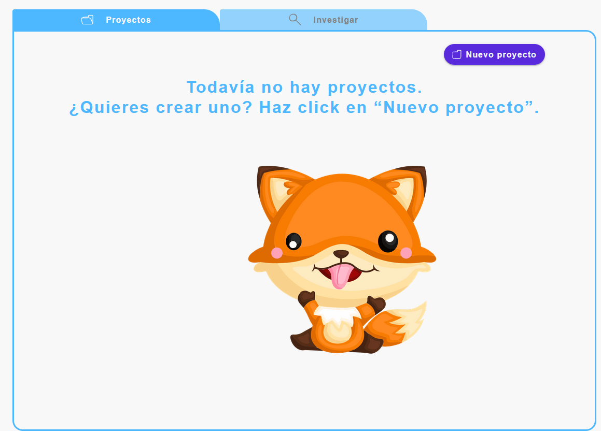
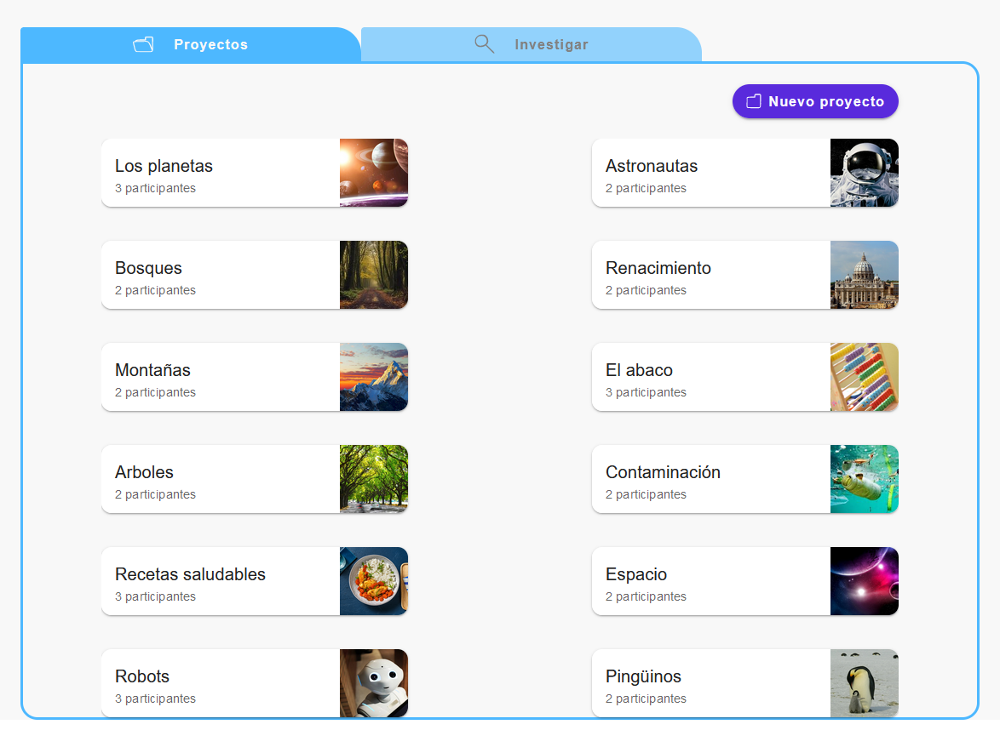
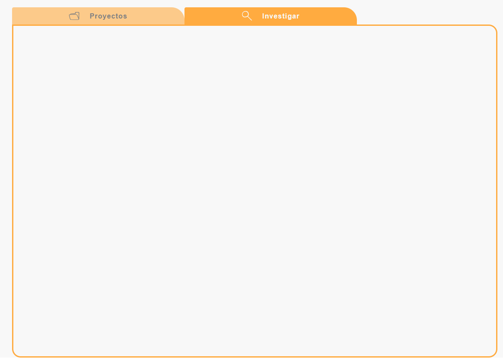

# Documentación de Componente BaseTabs

El componente `BaseTabs` es un componente de pestañas utilizado para alternar entre diferentes vistas en una aplicación. Este componente está diseñado para mostrar pestañas de proyectos e investigaciones.

El componente BaseTabs consiste en dos pestañas:

- Proyectos: Muestra una lista de proyectos existentes o un mensaje de que no hay proyectos.
- Investigar: Muestra una vista para investigar.

En la pestaña de "Proyectos", se puede hacer clic en el botón "Nuevo proyecto" para abrir un diálogo y crear un nuevo proyecto.

**Customización**

El componente permite personalizar los estilos de las pestañas y el contenido de cada pestaña según sea necesario. Consulta Material UI para ver más detalles sobre cómo personalizar el componente.

## Props

### `projects`

- **Tipo:** `Array`
- **Requerido:** Sí
- **Descripción:** Un array de objetos que representan los proyectos que se mostrarán en la pestaña "Proyectos".

## Uso

```jsx
import React, { useState} from 'react';
import PropTypes from 'prop-types';
import BoxContainer from '../../atoms/Box';
import FolderEmpty from '../../atoms/Icon/FolderEmpty';
import Search from '../../atoms/Icon/Search';
import Tabs from '@mui/material/Tabs';
import Tab from '@mui/material/Tab';
import Box from '@mui/material/Box';
import theme from '../../../theme/theme';
import Empty from '../../molecules/Empty';
import BasicButton from '../../atoms/Buttons/BasicButton';
import Folder from '../../atoms/Icon/CreateProyect';
import CreateProyect from '../../organisms/CreateProyect';
import Dashboard from '../../molecules/Dashboard';

const tabStyles = {
    minHeight: '2.5rem',
    minWidth: '25rem',
    padding: '6px 40px 6px 40px',
    borderRadius: '4px 30px 0px 0px',
    backgroundColor: theme.palette.accent.main,
    color: theme.palette.primary.contrastText,
    textTransform: 'none',
    display: 'flex',
    gap: '1.5rem',
    '& .MuiTab-wrapper': {
      flexDirection: 'row',
      gap: '0.5rem',
      alignItems: 'center',
    },
  };

  const selectedTabStyles = {
    backgroundColor: theme.palette.secondary.main,
    color: theme.palette.secondary.contrastText,
  };

  const CustomTabPanel = (props) => {
    const { children, value, index, ...other } = props; //destructuración de props

  return (
    <div
      role="tabpanel"
      hidden={value !== index}
      id={`simple-tabpanel-${index}`}
      aria-labelledby={`simple-tab-${index}`}
      {...other}
      style={{display: 'flex', justifyContent: 'center'}}
    >
      {value === index && (
        <Box>
          {children}
        </Box>
      )}
    </div>
  );
}

CustomTabPanel.propTypes = {
  children: PropTypes.node,
  index: PropTypes.number.isRequired,
  value: PropTypes.number.isRequired,
};

function a11yProps(index) {
  return {
    id: `simple-tab-${index}`,
    'aria-controls': `simple-tabpanel-${index}`,
  };
}

const BaseTabs = ({projects}) => {
  const [value, setValue] = useState(0);
  const [openDialog, setOpenDialog] = useState(false);

  const handleChange = (event, newValue) => {
    setValue(newValue);
  };

  return (
    <Box sx={{height:'50', width:'70rem', border: 'none'}}>
      <Box sx={{height:'2.5rem'}}>
        <Tabs value={value} indicatorColor='accent' textColor={'inherit'} onChange={handleChange} aria-label="Tabs-proyect" sx={{height:'2.5rem', width:'100%'}}>
          <Tab icon={<FolderEmpty color={`${value === 1 ?theme.palette.text.main : theme.palette.background.main}`} width={24}/>} iconPosition="start" label="Proyectos" {...a11yProps(0)} sx={{ ...tabStyles, ...(value === 1 && selectedTabStyles),  color: `${value === 1 ? theme.palette.text.main : theme.palette.background.main}` }}/>
          <Tab icon={<Search color={`${value === 0 ? theme.palette.text.main : theme.palette.background.main}`} width={24}/>} iconPosition="start" label="Investigar" {...a11yProps(1)}  sx={{ ...tabStyles, ...(value === 1 && selectedTabStyles),  color: `${value === 0 ? theme.palette.text.main : theme.palette.background.main}` }}/>
        </Tabs>
      </Box>
      <BoxContainer color={`${value === 1 ? theme.palette.secondary.main : theme.palette.accent.main}`} type={'section'} height={'48rem'} width={'70rem'} radius={'0 1.25rem 1.25rem 1.25rem'} sx={{overflow: 'auto'}}>
          <CustomTabPanel value={value} index={0}>
             <div style={ {display: 'flex', justifyContent: 'flex-end', marginTop: '1.5rem', marginBlock: '1.5rem' }}>
              <BasicButton variant="contained" childrenIcon={<Folder color={theme.palette.primary.contrastText} width={18}/>} childrenText="Nuevo proyecto" color="primary" ariaLabel="Crear nuevo proyecto" title="Crear nuevo proyecto" onClick={() => setOpenDialog(true)} borderRadius="6.25rem"/>
            </div>
              {projects.length > 0 ? ( <Dashboard projects={projects} /> ) : ( <Empty color={theme.palette.accent.main} title={'Todavía no hay proyectos.'} subtitle={'¿Quieres crear uno? Haz click en “Nuevo proyecto”.'}/> )}
              {openDialog && (<CreateProyect openDialog={openDialog} setOpenDialog={setOpenDialog}/>)}
          </CustomTabPanel>
          <CustomTabPanel value={value} index={0}>
            
          </CustomTabPanel>
      </BoxContainer>
    </Box>
  );
};

BaseTabs.propTypes = {
  projects: PropTypes.arrayOf(PropTypes.object).isRequired,
}

export default BaseTabs;
```

## Ejemplo de uso

```jsx
import React, {useState, useEffect} from 'react';
import BaseLayoutHome from '../../components/templates/BaseLayoutHome';
import BaseTabs from '../../components/molecules/Tabs';

//simulación de base de datos
import data from '../../data/projects.json';


const Home = () => {
    const [projects, setProjects] = useState([]);

    useEffect(() => {
        setProjects(data.projects);
    }, [])

  return (
    <BaseLayoutHome>
      <BaseTabs projects={projects}/>
    </BaseLayoutHome>
  )
}

export default Home
```



