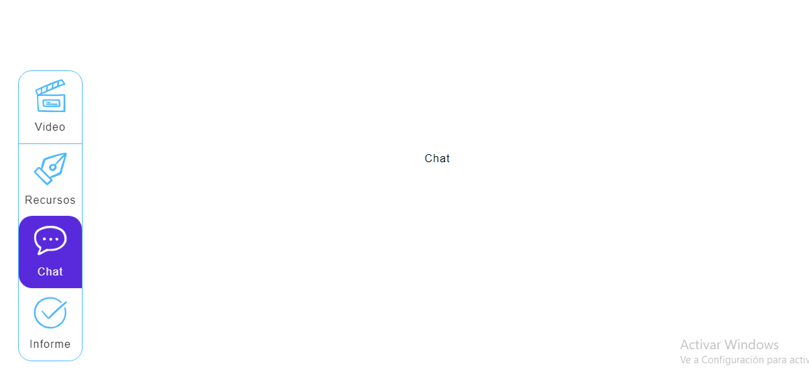

# Componente

## VerticalTabs/Siderbar

El componente  `VerticalTabs` es el Siderbar para poder navegar en los diferentes módulos en la elaboración del video

### Props

Este componente no acepta ninguna prop directamente.

### Estado

- **value** (número): Rastrea el índice de la pestaña actualmente seleccionada.

### Métodos

- **handleChange(event, newValue)**: Actualiza el estado de valor cuando se selecciona una pestaña.

## TabPanel

### Props

- **children** (`node`): El contenido para mostrar dentro del panel.
- **index** (`número`): El índice de la pestaña asociada con este panel.
- **value** (`número`): El índice de la pestaña actualmente seleccionada.

### Métodos

Este componente no define ningún método.

## a11yProps

### Parámetros

- **index** (`número`): El índice de la pestaña.

### Retorna

Un objeto que contiene las propiedades de accesibilidad para la pestaña.

## Ejemplo
```jsx
import React from 'react';
import VerticalTabs from '../molecules/VerticalTabs';

function MyComponent() {
  return (
    <div>
      <VerticalTabs />
    </div>
  );
}

export default MyComponent;

```




