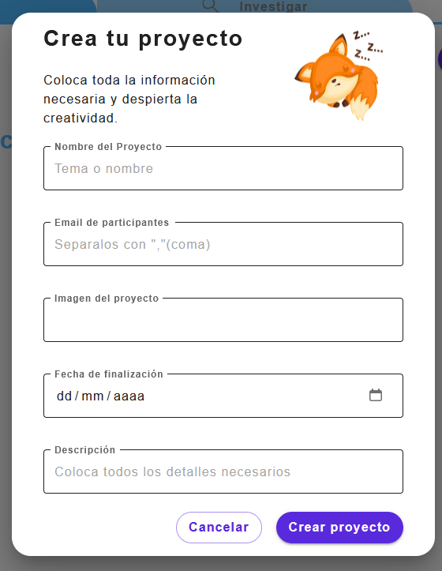

# CreateProyect

El componente `CreateProyect` se utiliza para crear un nuevo proyecto. Proporciona un formulario para introducir la información necesaria del proyecto.

## Props

- `openDialog` (`boolean`, obligatorio): Indica si el diálogo de creación de proyecto está abierto.
- `setOpenDialog` (`func`, obligatorio): Función para abrir o cerrar el diálogo.

## Estados

    formData: Objeto que contiene los datos del formulario.
        nameProyect (string): Nombre del proyecto.
        listEmails (string): Lista de correos electrónicos de los participantes.
        imgProyect (string): URL de la imagen del proyecto.
        finishDate (string): Fecha de finalización del proyecto.
        descriptionProyect (string): Descripción del proyecto.

    errors: Objeto que contiene los errores de validación.
        nameProyect (boolean): Indica si hay error en el nombre del proyecto.
        listEmails (boolean): Indica si hay error en la lista de correos electrónicos.
        imgProyect (boolean): Indica si hay error en la URL de la imagen del proyecto.
        finishDate (boolean): Indica si hay error en la fecha de finalización.
        descriptionProyect (boolean): Indica si hay error en la descripción del proyecto.

    processedData: Objeto que contiene los datos procesados del formulario, listos para ser enviados a la base de datos.

## Métodos

    handleCloseDialog(): Función para cerrar el diálogo.
    handleChange(event): Función para manejar el cambio en los campos del formulario.
    handleSubmit(e): Función para manejar el envío del formulario.

## Efectos

    useEffect: Efecto para simular el envío de datos a la base de datos.

## Componentes de Material-UI Utilizados

    Dialog
    DialogContent
    DialogActions
    Typography

## Componentes Personalizados Utilizados

    InputField
    BasicButton

## Uso

```jsx
import { useState } from 'react';
import CreateProyect from './CreateProyect'; 

const App = () => {
  const [openDialog, setOpenDialog] = useState(false);

  return (
    <div>
      <button onClick={() => setOpenDialog(true)}>Abrir formulario</button>
      <CreateProyect openDialog={openDialog} setOpenDialog={setOpenDialog} />
    </div>
  );
};

export default App;
```

