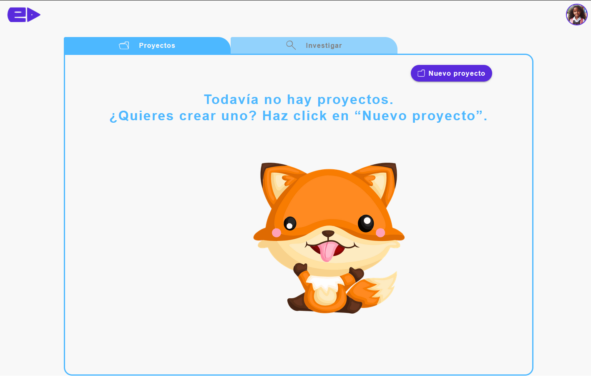

# Documentación del Componente Home

Este componente renderiza la página principal de la aplicación. Utiliza BaseLayoutHome como el diseño principal y BaseTabs para mostrar una lista de proyectos.

## Props

- projects: (array) Una lista de proyectos que se mostrarán en las pestañas. Cada proyecto debe tener una estructura específica. Se espera que cada proyecto tenga al menos un id, name.
- description, y otros campos opcionales según sea necesario.

## Hooks

- useState: Se utiliza para mantener el estado de los proyectos.
- useEffect: Se utiliza para cargar los proyectos desde la simulación de base de datos una vez que el componente está montado.

## Archivos de Datos

Este componente importa datos de un archivo JSON para simular una base de datos. Puedes cambiar la importación de datos para probar diferentes escenarios:

- projectEmpty.json: Un archivo JSON con una lista vacía de proyectos.
- oneProject.json: Un archivo JSON con un solo proyecto.
- projects.json: Un archivo JSON con múltiples proyectos.

## Uso

```jsx
import React, { useState, useEffect } from 'react';
import BaseLayoutHome from '../../components/templates/BaseLayoutHome';
import BaseTabs from '../../components/molecules/Tabs';

// Simulación de base de datos
import data from '../../data/projectEmpty.json';
// import data from '../../data/oneProject.json';
// import data from '../../data/projects.json';

const Home = () => {
    const [projects, setProjects] = useState([]);

    useEffect(() => {
        setProjects(data.projects);
    }, []);

    return (
        <BaseLayoutHome>
            <BaseTabs projects={projects} />
        </BaseLayoutHome>
    );
}

export default Home;
```

## Ejemplo de uso

```jsx
import { ThemeProvider } from '@mui/material/styles';
import theme from './theme/theme.js';
import Home from './pages/Home';
import './App.css';

function MyApp() {
  return (
    <ThemeProvider theme={theme}>
      <Home/>
    </ThemeProvider>
  )
}

export default MyApp

```

